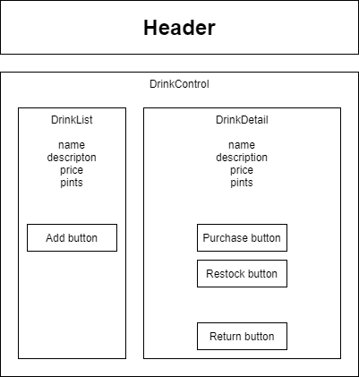

# Rootdown by Pierre

#### A React app for mananaging the inventory of root-based drinks.

#### By _**Scott Hutley**_

## Technologies Used

* JavaScript
* React
* HTML
* CSS
* NPM

## Description

Pierre is at it again! This time his business venture involves selling root-based vegetable drinks. With this app, Pierre can add new drink options for customers, track their sale and tap new kegs as needed.

## Setup and Installation

* Clone https://github.com/Singleballtheory/Rootdown to your computer
* Navigate to the Rootdown directory in your terminal
* At the $ prompt, enter "npm install"
* Enter "npm run build" to launch app in browser

## Known Bugs

* Missing delete and edit options. 
* Missing most styling and therefor does not currently align with project Diagram

## License

[MIT](https://opensource.org/licenses/MIT)

_Copyright (c) 2021 Scott Hutley_

## Contact Information

_Scott Hutley <scotthutley1@comcast.net>_
